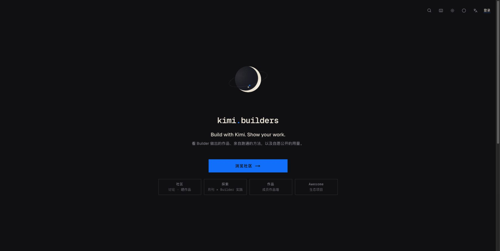
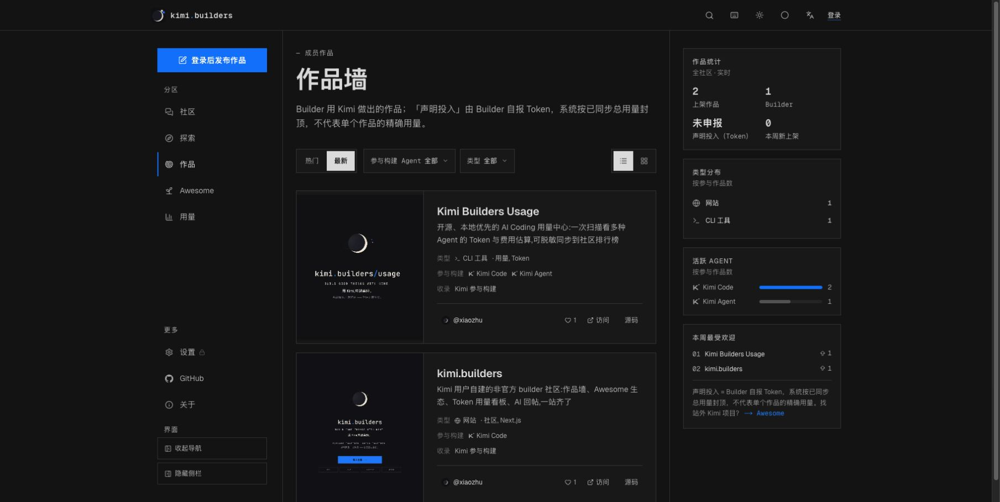
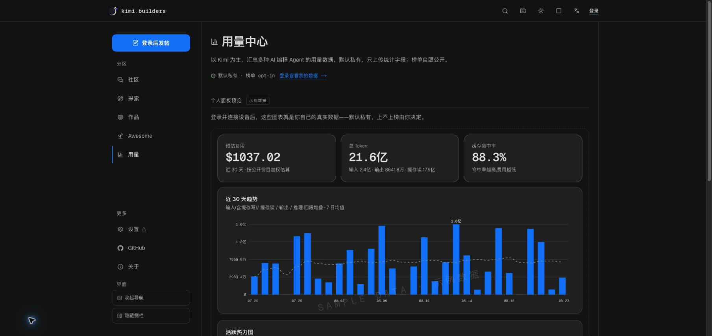

# kimi.builders

[English](./README_EN.md) · 中文

> **Build with Kimi. Show your work.**

[kimi.builders](https://kimi.builders) 是 Kimi 用户自建自运营的非商业 Builder
社区（非官方）。这里连接具体讨论、Builder 亲自跑通的实践、已经做出的作品，
以及成员自愿公开的聚合用量。

[访问社区](https://kimi.builders) ·
[GitHub 组织](https://github.com/kimi-builders) ·
[用量 CLI](https://github.com/kimi-builders/usage) ·
[Awesome 清单](https://github.com/kimi-builders/awesome-kimi-builders)



## 社区里有什么

### 社区

发帖、评论、投票、订阅和通知组成公开讨论区。帖子支持文字、链接与投票，可设为
私密内容；治理状态、精选理由和编辑署名尽量靠近对应对象展示。

### 探索

探索区承载月刊评鉴和 Builder 亲自跑通的实践。内容强调方法、证据与出处，而不是
无限扩张的教程或资讯仓库；分类、产品、职业、标签和归档只在有内容时出现。

### 作品与 Awesome

- **作品墙**收录成员用 Kimi 做出的作品，可附链接、源码、媒体和声明 Token；
- **Awesome**是成员推荐的站外 Kimi 相关项目，保留原作者、来源和收录口径；
- 两者共享作品详情与讨论能力，但不会把站外项目写成本站成员作品。

声明 Token 由 Builder 自报，系统只按已同步的聚合总用量封顶；它不是单个作品的
精确消耗，也不构成能力认证或官方背书。

### 用量中心

[kimi-builders/usage](https://github.com/kimi-builders/usage) 从 Kimi Code、
Claude Code、Codex、OpenCode 等 Agent 已保存在本机的日志中汇总 Token、标准 API
费用估算、活跃时间、模型和项目分布。CLI 本地优先、无需账号即可查看；同步到
社区是可选能力，只上传脱敏聚合字段。个人数据默认私有，公开榜必须由成员主动加入。

### 小筑与 `@kimi`

小筑是社区运营的 AI 助手。发帖时可以允许它自动回复，也可以在帖子、作品或
Awesome 的讨论中写 `@kimi` 召唤。内容所有者能关闭 AI 参与，浏览者也能隐藏
AI 回复；小筑的回复不代表 Moonshot AI 官方立场。

## 生产界面

以下截图直接来自 [kimi.builders](https://kimi.builders) 线上环境，中文 README
只使用中文界面截图。

| 作品墙 | 用量中心公开预览 |
|---|---|
|  |  |

## 核验边界

kimi.builders 不把语气当证据。站内尽量把以下线索放在内容旁边：

- 作品链接、源码、媒体与原作者；
- Builder 实践中的方法、证据和出处；
- 精选理由与执行编辑；
- 成员选择公开的聚合用量；
- 声明 Token 的来源和限制。

这些信息帮助读者自行判断，不等于 Kimi、Moonshot AI 或社区对作品效果作担保。

## 相关项目

- **[kimi-builders/usage](https://github.com/kimi-builders/usage)**：本地优先的
  多 Agent 用量采集 CLI，npm 包为 `@kimi.builders/usage`；
- **[awesome-kimi-builders](https://github.com/kimi-builders/awesome-kimi-builders)**：
  社区维护的站外项目来源清单；
- **[kimi-builders-brand-kit](https://github.com/kimi-builders/kimi-builders-brand-kit)**：
  月球、轨道与双星组成的社区品牌资产包，站点版本位于 `public/brand/`。

## 技术架构

- **Web**：Next.js 16 App Router（Turbopack）、React 19、TypeScript strict；
- **样式**：Tailwind CSS v4，通过 `app/globals.css` 的语义令牌支持深色/浅色主题与
  poster/soft 两种视觉气质；
- **数据**：MySQL 8 + `mysql2` 裸 SQL，无 ORM；
- **认证**：GitHub、Google OAuth，以及邮箱密码登录；
- **存储与邮件**：Cloudflare R2、Resend；
- **AI**：Moonshot API，任务队列负责重试与限流；
- **运行环境**：Caddy + PM2 自托管，发布脚本执行迁移、原子切换、健康检查和失败回滚。

```text
app/              App Router 页面、Server Actions 与 API 路由
components/       跨分区共享组件
src/lib/          数据层、认证、社区、作品、探索、用量与 AI 模块
db/schema.sql     新装数据库的终态结构
db/migrations/    按 migration-order.txt 追加执行的历史迁移
tests/            单测与真实 MySQL 集成测试
docs/             入库文档和 README 图片
ops/              PM2、自托管部署与运行维护脚本
```

## 本地运行

要求 Node.js 22（见 `.nvmrc`）和 MySQL 8。

```bash
npm install
cp .env.example .env.local

mysql -uroot -e 'CREATE DATABASE kimi_builders CHARACTER SET utf8mb4 COLLATE utf8mb4_unicode_ci'
mysql -uroot kimi_builders < db/schema.sql
npm run db:migrate

npm run dev
```

打开 <http://localhost:3000>。完整环境变量说明见 [`.env.example`](./.env.example)，
最小可用环境至少需要：

| 变量 | 用途 |
|---|---|
| `DATABASE_URL` | MySQL 连接 |
| `AUTH_SECRET` | 会话签名 |
| `AUTH_GITHUB_ID/SECRET`、`AUTH_GOOGLE_ID/SECRET` | OAuth 登录，可按需配置 |
| `KIMI_API_KEY`、`KIMI_MODEL` | 小筑自动回复与 `@kimi` |
| `R2_*` | Logo、封面、配图和头像上传 |
| `RESEND_API_KEY`、`MAIL_FROM` | 找回密码等事务邮件 |
| `USAGE_KEY_PEPPER`、`CRON_SECRET` | 用量凭证与定时任务鉴权 |

缺少可选服务密钥时，对应能力应软失败，不应拖垮其他页面。

## 测试与提交门禁

提交前运行完整门禁：

```bash
npx tsc --noEmit && npm run lint && npm test && npm run build
```

数据库集成测试只允许使用名称包含 `kbu-mysql` 的隔离库：

```bash
export DATABASE_URL='mysql://root@127.0.0.1:3306/kbu-mysql'
npm run test:usage-db
npm run test:analytics-db
npm run test:auth-db
npm run test:works-db
npm run test:moderation-db
```

数据库变更必须新增 migration、追加到 `db/migration-order.txt` 末尾，并同步
`db/schema.sql` 的终态。已有 migration 和既有执行顺序不可修改。

## 公开价格目录 API

本站与用量 CLI 共用版本化标准 API 美元价格目录：

```text
GET https://kimi.builders/api/public/usage-pricing/v1/catalog
```

端点无需登录，支持 `ETag` / `If-None-Match`，只返回模型匹配规则、价格、生效窗口
与来源，不接收或返回用户用量。CLI 会校验 schema、revision 和 SHA-256，失败时
继续使用本机 last-known-good 或随包快照；同一 revision 不允许静默替换内容。

## 部署

生产环境不使用 Vercel。GitHub Actions 构建 Next.js standalone 产物并上传服务器，
`ops/deploy-release.sh` 在切换版本前执行数据库迁移，然后由 PM2 原子启动新 release，
通过 `/api/health` 核对版本；失败时恢复上一 release。Caddy 负责 HTTPS 与反向代理。

## 参与维护

欢迎提交 Issue 和 PR。新增页面、数据结构或产品文案前，请先阅读仓库根目录的
`AGENTS.md` 及相关内部规范；PR 至少应通过上方门禁。不要在公开 Issue 中提交密钥、
私密用量或可利用的漏洞细节。

安全问题请发送至 **we@kimi.builders**，详见 [SECURITY.md](./SECURITY.md)。

## 关系说明与许可

kimi.builders 由 Kimi 用户自建自运营，现阶段为非商业社区。本站与 Moonshot AI
（月之暗面）无隶属、赞助、背书或授权关系；相关名称与商标归其权利人所有。

代码采用 [MIT License](./LICENSE)。
