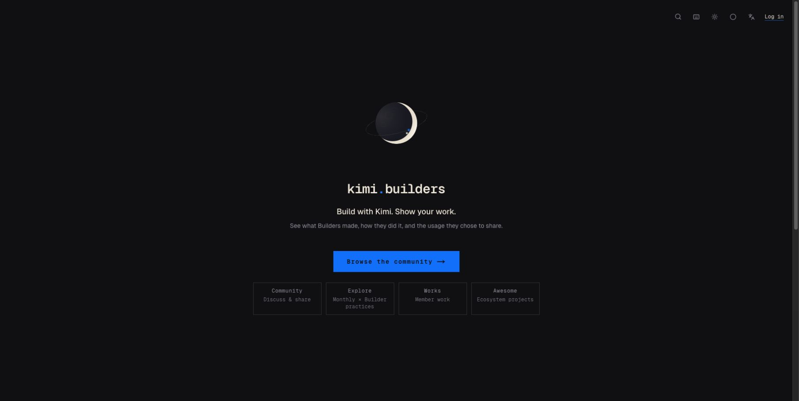
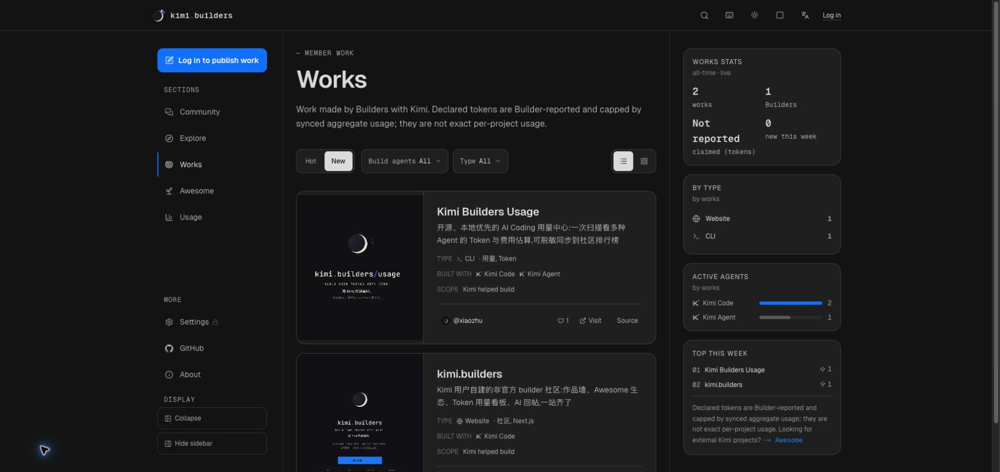
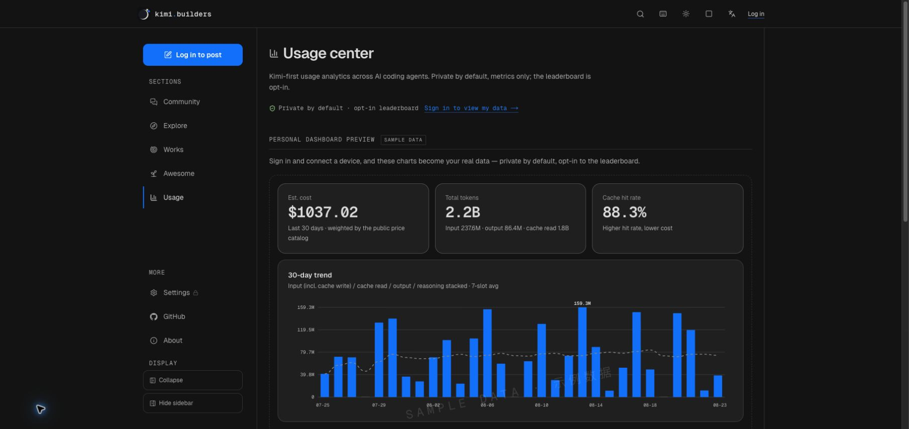

# kimi.builders

English · [中文](./README.md)

> **Build with Kimi. Show your work.**

[kimi.builders](https://kimi.builders) is a user-run, non-commercial community
for Builders using Kimi (unofficial). It brings together specific discussions,
practices Builders ran themselves, work they made, and aggregate usage members
chose to share.

[Visit the community](https://kimi.builders) ·
[GitHub organization](https://github.com/kimi-builders) ·
[Usage CLI](https://github.com/kimi-builders/usage) ·
[Awesome list](https://github.com/kimi-builders/awesome-kimi-builders)



## What lives here

### Community

Posts, comments, polls, subscriptions, and notifications form the public discussion
space. Posts can contain text, links, or polls and may be kept private. Moderation
states, editorial reasons, and editor attribution stay close to the object they affect.

### Explore

Explore is home to the Monthly and practices Builders have run themselves. It favors
methods, evidence, and sources over an ever-growing tutorial or news archive. Category,
product, role, tag, and archive lenses appear only when content exists for them.

### Works and Awesome

- **Works** is the wall for work members made with Kimi, with optional links, source,
  media, and declared tokens;
- **Awesome** contains external Kimi-related projects recommended by members, keeping
  the original author, source, and collection scope visible;
- both use the same project detail and discussion system, without presenting external
  projects as member work.

Declared tokens are Builder-reported and only capped by synced aggregate usage. They
are not exact per-project consumption, a skill credential, or an official endorsement.

### Usage center

[kimi-builders/usage](https://github.com/kimi-builders/usage) reads logs already stored
locally by Kimi Code, Claude Code, Codex, OpenCode, and other agents, then aggregates
tokens, standard-API cost estimates, active time, model usage, and project breakdowns.
The CLI is local-first and works without an account. Syncing sanitized aggregates to
the community is optional; personal data is private by default, and the leaderboard is
strictly opt-in.

### Xiaozhu and `@kimi`

Xiaozhu is the community-operated AI assistant. Authors can allow an automatic reply
when posting, or members can write `@kimi` in discussions under posts, works, and
Awesome entries. Content owners can turn AI participation off, and readers can hide AI
replies. Xiaozhu's responses do not represent Moonshot AI.

## Production UI

The screenshots below come directly from the production site at
[kimi.builders](https://kimi.builders). The English README uses English-interface
screenshots only.

| Works | Public usage preview |
|---|---|
|  |  |

## Verification boundaries

kimi.builders does not treat confident language as evidence. Wherever possible, the
site keeps these clues next to the content they support:

- project links, source code, media, and original authors;
- methods, evidence, and sources for Builder practices;
- editorial reasons and the editor who made the call;
- aggregate usage a member chose to make public;
- the provenance and limits of declared tokens.

These clues help readers make their own judgment. They are not a guarantee from Kimi,
Moonshot AI, or the community that a project will perform as described.

## Related projects

- **[kimi-builders/usage](https://github.com/kimi-builders/usage)** — the local-first,
  multi-agent usage collector published as `@kimi.builders/usage` on npm;
- **[awesome-kimi-builders](https://github.com/kimi-builders/awesome-kimi-builders)** —
  the community-maintained source list for external projects;
- **[kimi-builders-brand-kit](https://github.com/kimi-builders/kimi-builders-brand-kit)** —
  the moon, orbit, and twin-star brand assets, vendored into `public/brand/`.

## Architecture

- **Web**: Next.js 16 App Router with Turbopack, React 19, strict TypeScript;
- **Styling**: Tailwind CSS v4 with semantic tokens in `app/globals.css`, dark/light
  themes, and poster/soft visual vibes;
- **Data**: MySQL 8 through raw `mysql2` SQL, with no ORM;
- **Authentication**: GitHub and Google OAuth plus email/password;
- **Storage and mail**: Cloudflare R2 and Resend;
- **AI**: Moonshot API behind a rate-limited job queue with retries;
- **Runtime**: self-hosted behind Caddy and PM2, with migrations, atomic release
  switching, health checks, and rollback.

```text
app/              App Router pages, Server Actions, and API routes
components/       Components shared across sections
src/lib/          Data, auth, community, works, Explore, usage, and AI modules
db/schema.sql     Final schema for a fresh database
db/migrations/    Historical migrations appended through migration-order.txt
tests/            Unit tests and isolated real-MySQL integration tests
docs/             Versioned documentation and README images
ops/              PM2, self-hosted deployment, and operations scripts
```

## Run locally

You need Node.js 22 (see `.nvmrc`) and MySQL 8.

```bash
npm install
cp .env.example .env.local

mysql -uroot -e 'CREATE DATABASE kimi_builders CHARACTER SET utf8mb4 COLLATE utf8mb4_unicode_ci'
mysql -uroot kimi_builders < db/schema.sql
npm run db:migrate

npm run dev
```

Open <http://localhost:3000>. See [`.env.example`](./.env.example) for the complete,
commented configuration. A useful environment may include:

| Variable | Purpose |
|---|---|
| `DATABASE_URL` | MySQL connection |
| `AUTH_SECRET` | Session signing |
| `AUTH_GITHUB_ID/SECRET`, `AUTH_GOOGLE_ID/SECRET` | Optional OAuth providers |
| `KIMI_API_KEY`, `KIMI_MODEL` | Xiaozhu auto-replies and `@kimi` summons |
| `R2_*` | Logo, cover, image, and avatar uploads |
| `RESEND_API_KEY`, `MAIL_FROM` | Password reset and other transactional mail |
| `USAGE_KEY_PEPPER`, `CRON_SECRET` | Usage credentials and cron authentication |

When an optional service is not configured, its feature should fail soft without
taking unrelated pages down.

## Tests and gates

Run the complete gate before submitting a change:

```bash
npx tsc --noEmit && npm run lint && npm test && npm run build
```

Database integration tests only run against an isolated database whose name contains
`kbu-mysql`:

```bash
export DATABASE_URL='mysql://root@127.0.0.1:3306/kbu-mysql'
npm run test:usage-db
npm run test:analytics-db
npm run test:auth-db
npm run test:works-db
npm run test:moderation-db
```

Schema changes require a new migration appended to `db/migration-order.txt` and the
same terminal state in `db/schema.sql`. Existing migrations and their order are
immutable.

## Public pricing catalog API

The site and usage CLI share one versioned standard-API USD pricing catalog:

```text
GET https://kimi.builders/api/public/usage-pricing/v1/catalog
```

The endpoint is public and supports `ETag` / `If-None-Match`. It returns model matching
rules, prices, effective windows, and provenance—never user usage. The CLI validates
the schema, revision, and SHA-256, then falls back to a last-known-good cache or bundled
snapshot when an update fails. Content cannot be silently replaced under an existing
revision.

## Deployment

Production does not use Vercel. GitHub Actions builds a Next.js standalone artifact
and uploads it to the server. `ops/deploy-release.sh` runs database migrations before
switching releases, starts the new release atomically through PM2, verifies its version
through `/api/health`, and restores the previous release on failure. Caddy terminates
HTTPS and reverse-proxies the app.

## Contributing

Issues and pull requests are welcome. Read the repository-level `AGENTS.md` and the
relevant internal specifications before adding routes, data structures, or product
copy; every PR should at least pass the gates above. Never place secrets, private usage,
or exploitable vulnerability details in a public issue.

Report security issues to **we@kimi.builders**. See [SECURITY.md](./SECURITY.md).

## Relationship and license

kimi.builders is built and run by Kimi users and currently operates as a non-commercial
community. It is not affiliated with, sponsored, endorsed, or authorized by Moonshot AI
(月之暗面). Related names and marks belong to their respective owners.

The code is available under the [MIT License](./LICENSE).
