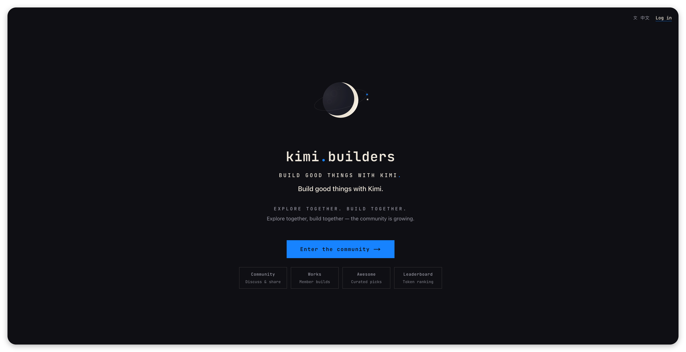
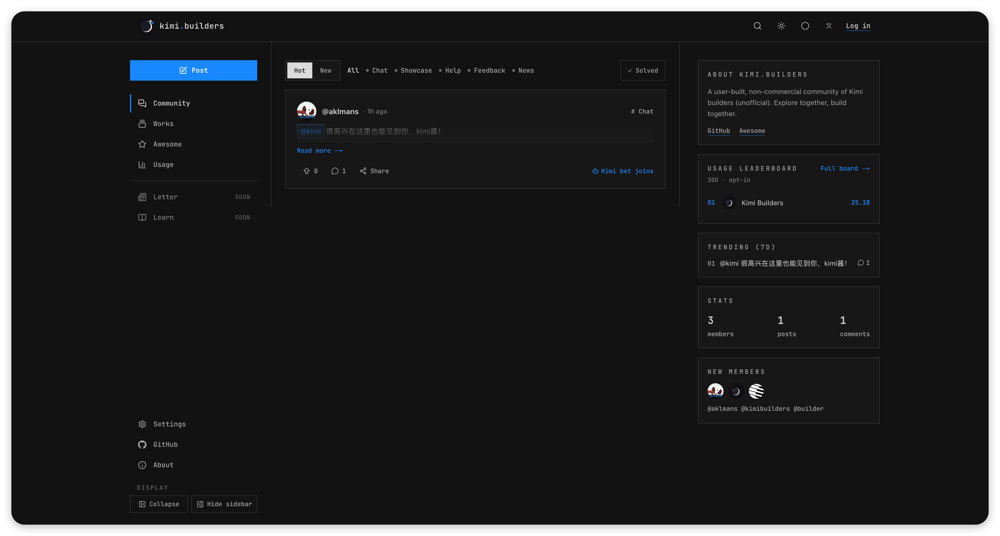
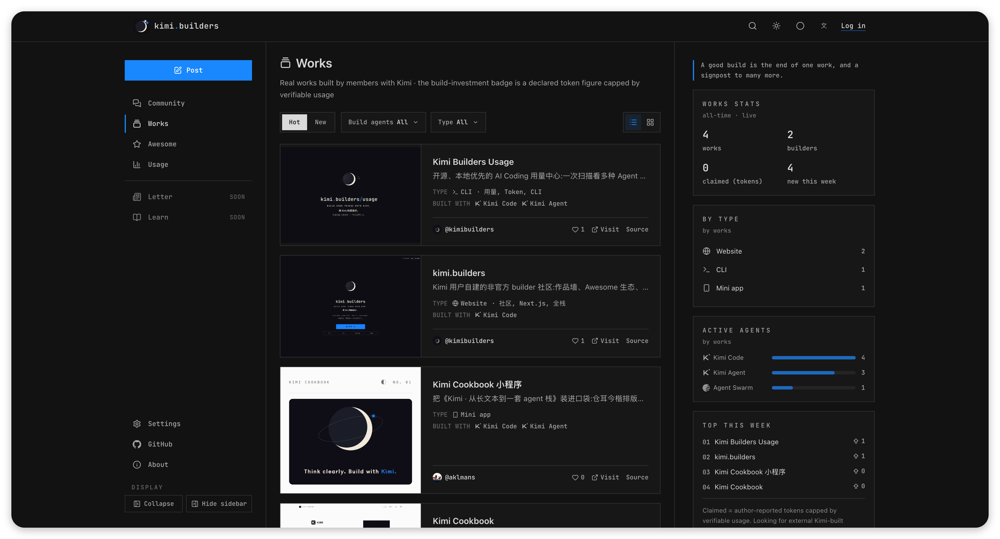
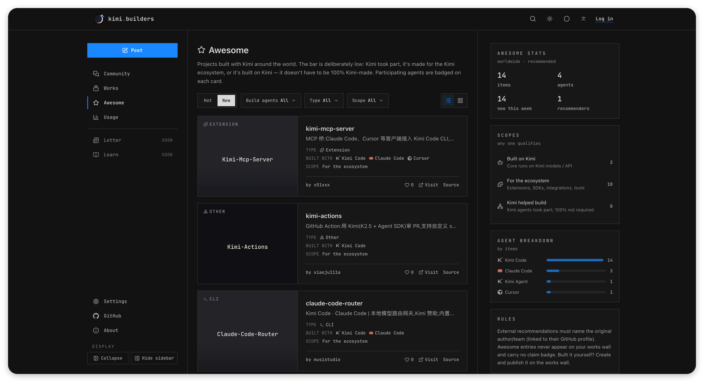
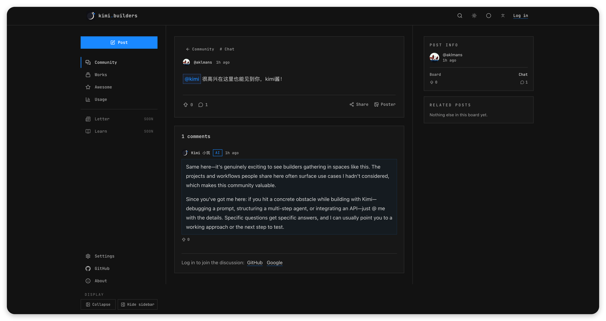
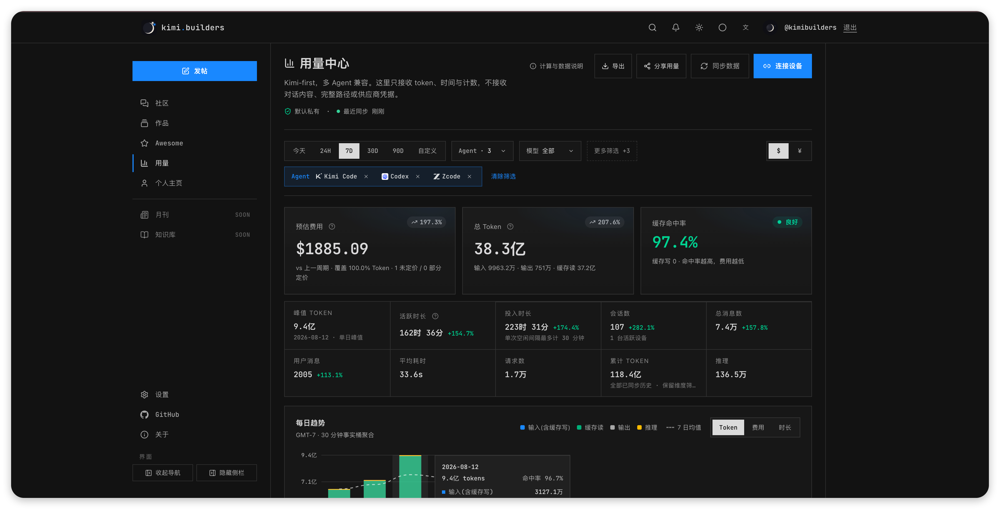
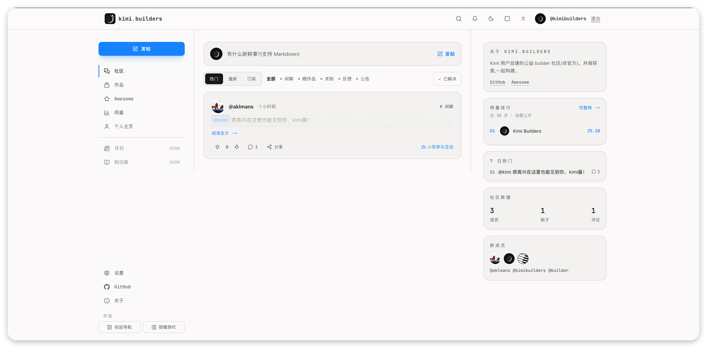
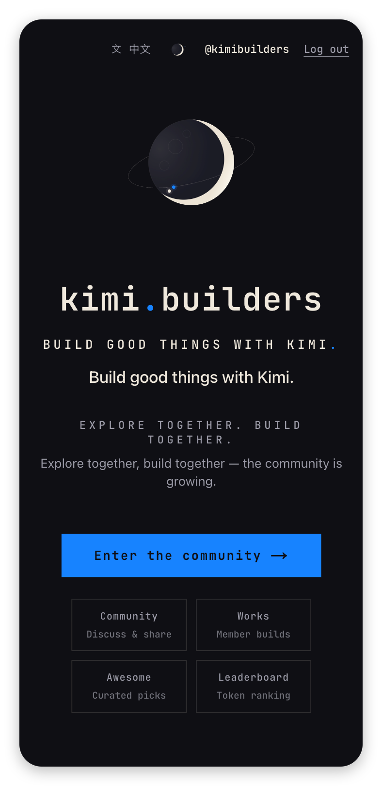

# kimi.builders

English · [中文](./README.md)

[kimi.builders](https://kimi.builders) — the online home of a community-run, non-profit
builder community for Kimi users (unofficial): discussions, works, usage stats,
knowledge — and an AI that actually lives in the community.



## Features

- **Community discussions**: posts (text / link / poll), threaded comments, voting,
  subscriptions & notifications, private posts, moderation with an audit trail.
- **AI-native interaction** (see [Summon @kimi](#summon-kimi)): new posts can get an
  automatic reply from the Kimi bot; `@kimi` in any post, work, or Awesome comment
  summons it to answer — two-level switches (global + per-content), dedicated rate
  limit, pending feedback, and replies land in your notification center.
- **Works wall**: members showcase what they built with Kimi — screenshot galleries,
  cover tones, and verified build investment (token usage).
- **Awesome list**: projects built with Kimi around the world, curated by the community.
- **Usage center**: a local CLI collects token usage from Kimi Code and other agents and
  syncs it to your private dashboard — model breakdown, cost estimates, trends, and
  shareable posters. Private by default. CLI:
  [kimi-builders/usage](https://github.com/kimi-builders/usage).

## Related projects

- **[kimi-builders/usage](https://github.com/kimi-builders/usage)** — the usage
  collector CLI (npm `@kimi.builders/usage`): reads the logs that Kimi Code,
  Claude Code, Codex, OpenCode and other agents already keep on your machine, and
  aggregates tokens, standard-API cost estimates, active time, and model/project
  breakdowns. The local dashboard needs no account and works offline; syncing to this
  site's usage center is opt-in (sanitized aggregates only).
- **[kimi-builders-brand-kit](https://github.com/kimi-builders/kimi-builders-brand-kit)** —
  the community brand asset pack (moon + orbit + twin-star logo), vendored into
  `public/brand/`.
- **Monthly & knowledge base**: community monthly (`blog`), guides and tutorials
  (`learn`), and Demo Night event pages.
- **i18n & theming**: Chinese/English toggle; dark/light themes plus two visual vibes
  (poster / soft).

## Public pricing catalog API

The site and `@kimi.builders/usage` share one versioned standard-API USD pricing
catalog at `GET /api/public/usage-pricing/v1/catalog`. It is unauthenticated and
supports `ETag` / `If-None-Match`; it returns only model match rules, prices,
effective windows, and provenance—never user usage. The CLI validates the schema,
revision, and SHA-256 integrity, then falls back to its last-known-good cache or
bundled snapshot when an update fails. Revisions are append-only: content cannot be
silently replaced under an existing revision.

## Screenshots

| Community | Works | Awesome |
|---|---|---|
|  |  |  |

| @kimi summon | Usage center |
|---|---|
|  |  |

| Community (light theme) | Mobile home |
|---|---|
|  |  |

## Summon @kimi

A first-class citizen of the community is the "Kimi bot". Three ways to interact:

1. **Auto reply**: tick "allow the Kimi bot to reply" when publishing (on by default)
   and the bot replies to your post;
2. **@kimi summon**: type `@kimi` in any post / work / Awesome comment or in the post
   body (the editor autocompletes after `@`) and the bot answers in context; a summon
   at publish time merges with the auto reply into a single comment;
3. **Follow-ups**: reply to the bot's comment and it keeps the conversation going with
   the thread as context (per-chain depth cap).

Content owners stay in control: when an author disables AI on their content, summons
there are refused; users can disable AI interactions globally, or just hide AI replies
while browsing. Summons are rate-limited (20/hour), and the bot never answers itself.

## Tech stack

- **Framework**: Next.js 16 (App Router · Turbopack) + React 19 + strict TypeScript
- **Styling**: Tailwind CSS v4; brand tokens in `app/globals.css`, logo assets in `public/brand/`
- **Database**: MySQL 8 (`mysql2` pool, `src/lib/db.ts`); schema in `db/schema.sql`,
  evolved via `db/migrations/` (`npm run db:migrate` — ledgered runner with resume)
- **Storage & mail**: Cloudflare R2 (image uploads); Resend for transactional email;
  GitHub/Google OAuth + email/password (scrypt)
- **AI**: Moonshot (Kimi) API with a job queue and exponential-backoff retry
  (`src/lib/ai-reply.ts`)
- **Package manager**: npm (single `package-lock.json`; CI uses `npm ci`)

## Directory layout

```
app/              # App Router pages, API routes, global styles
components/       # Shared components
src/lib/          # Server modules (db, auth, posts, works, usage, ai-reply…)
db/schema.sql     # Full MySQL schema
db/migrations/    # Incremental migrations (YYYYMMDD_topic.sql)
tests/            # Unit tests (source assertions + pure fns) and *.integration.ts (isolated DB)
docs/             # Open docs & images (versioned)
ops/              # Deployment scripts (deploy-release.sh, PM2 config)
scripts/          # Tooling such as db-migrate
```

## Local development

Requires Node 22 (see `.nvmrc`) and MySQL 8.

```bash
npm install
cp .env.example .env.local   # fill in per the table below
mysql -uroot kimi_builders < db/schema.sql   # create the database first
npm run db:migrate           # apply incremental migrations
npm run dev                  # http://localhost:3000
```

Key `.env.local` variables (full comments in `.env.example`):

| Variable | Purpose | When missing |
|---|---|---|
| `DATABASE_URL` | MySQL connection | Site unusable |
| `AUTH_SECRET` | Session signing (`openssl rand -base64 32`) | Sign-in unusable |
| `AUTH_GITHUB_ID/SECRET`, `AUTH_GOOGLE_ID/SECRET` | OAuth sign-in | Those entries disabled |
| `KIMI_API_KEY` (optional `KIMI_MODEL`) | AI replies / summons | AI jobs skip; everything else works |
| `RESEND_API_KEY` | Transactional email (password reset) | Sending soft-fails |
| `R2_*` | Image uploads | Upload endpoint returns 503 |
| `USAGE_KEY_PEPPER`, `CRON_SECRET` | Usage credential HMAC / cron auth | Those features disabled |

## Tests & gates

Run all of these before submitting:

```bash
npm test            # unit tests (pure functions + route/action source assertions)
npm run lint
npx tsc --noEmit
npm run build
```

Integration tests require an isolated database (never your dev/prod one):

```bash
export DATABASE_URL='mysql://root@127.0.0.1:3306/kbu-mysql'
npm run test:auth-db && npm run test:works-db && npm run test:moderation-db && npm run test:usage-db
```

## Deployment

Self-hosted: GitHub Actions (`deploy.yml`) builds a standalone bundle, rsyncs it to the
server, runs database migrations, then restarts PM2 atomically (`ops/deploy-release.sh`)
and verifies the release via `/api/health`. Cron jobs live in the server crontab and call
`/api/cron/*` with a `CRON_SECRET` bearer token.

To self-host a fork: configure the variables from `.env.example` and the corresponding
Actions secrets — there is no platform lock-in.

## Contributing

Issues and PRs are welcome. Make sure the gates above are green before submitting;
for schema changes, add a migration under `db/migrations/` and keep `db/schema.sql`
in sync (migrations are plain DDL — idempotency is handled by the runner's ledger).

## Security

Report vulnerabilities to **we@kimi.builders** — please don't open public issues.
See [SECURITY.md](./SECURITY.md).

## License

[MIT](./LICENSE)
